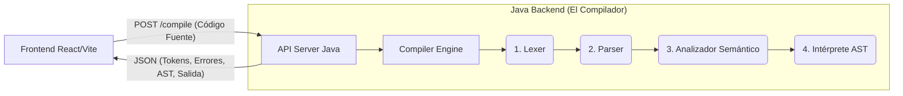

#  KnightScript

KnightScript es un lenguaje de programación y compilador educativo fuertemente inspirado en la estética, atmósfera y lore de **Hollow Knight**. Originalmente concebido como una aplicación de escritorio de Java puro, KnightScript ha evolucionado hacia una **arquitectura web moderna** basada en una API REST en Java (Backend) y un frontend inmersivo e interactivo construido con React y Vite.

Este proyecto abarca la construcción completa de un compilador desde cero, demostrando de manera práctica las fases clásicas de la teoría de compiladores (Análisis Léxico, Sintáctico, Semántico e Interpretación). Además, integra estos conceptos teóricos en un ecosistema web profesional, listo para ser desplegado en plataformas modernas en la nube como Vercel y Render.

---

##  Arquitectura General del Sistema

El proyecto está dividido en dos componentes principales desacoplados que se comunican mediante HTTP/REST:

1. **Backend (El Compilador y la API):** Escrito íntegramente en Java. Contiene toda la lógica pesada del compilador y un servidor HTTP liviano.
2. **Frontend (La Interfaz Web):** Desarrollado con React y Vite, ofrece un editor de código inmersivo, visualización de errores en tiempo real, introspección de la tabla de símbolos y ejecución asíncrona.

---

##  Fases del Compilador (Backend)

El corazón analítico de KnightScript reside en la carpeta `src/`. El proceso de compilación fluye de manera estrictamente secuencial a través de múltiples módulos especializados, donde la salida de uno es la entrada del siguiente.

### 1. Análisis Léxico (`src/Lexer/`)
**Objetivo:** Convertir el código fuente (una cadena de texto plano) en una secuencia de componentes léxicos válidos conocidos como **Tokens**.
- **`Lexer.flex`**: Archivo de definición para la herramienta **JFlex**. Contiene las expresiones regulares que definen las palabras clave, operadores, literales (números, cadenas) e identificadores del lenguaje KnightScript.
- **`Lexer.java`**: Clase Java autogenerada por JFlex. Es un escáner que lee el archivo de entrada carácter por carácter y los agrupa en Tokens reconocibles. Además, tiene la responsabilidad de detectar caracteres extraños o no válidos, generando la lista de **Errores Léxicos** (`ErrorLexico`).

### 2. Análisis Sintáctico (`src/parser/`)
**Objetivo:** Verificar que la secuencia de Tokens proveniente del Lexer cumpla rigurosamente con las reglas gramaticales del lenguaje y, simultáneamente, construir el Árbol Sintáctico Abstracto (AST).
- **`parser.cup`**: Archivo de definición para **CUP** (Constructor of Useful Parsers). Contiene la gramática libre de contexto de KnightScript expresada en formato BNF.
- **`Parser.java` y `sym.java`**: Clases Java autogeneradas por CUP. `sym` actúa como un diccionario de constantes enteras para cada tipo de token. El `Parser` procesa el flujo de tokens y valida la estructura global (por ejemplo, asegura que un bucle `Mientras` contenga una condición válida y un bloque de llaves). Mediante acciones semánticas embebidas, el Parser instancia los nodos del AST. En caso de estructuras rotas o faltantes, genera reportes detallados de **Errores Sintácticos** (`ErrorSintactico`).

### 3. Árbol Sintáctico Abstracto - AST (`src/compilador/ast/`)
**Objetivo:** Representar la estructura lógica fundamental del programa en la memoria mediante un árbol jerárquico unidireccional.
- **Clases de Nodos (`ASTNode`, `Programa`, `Si`, `Mientras`, `Expresion`, `Asignacion`, `Declaracion`, `For`, etc.)**: Cada instrucción o estructura de control en KnightScript cuenta con su propia clase Java que hereda de la interfaz o clase base `ASTNode`. Estas clases almacenan los atributos lógicos (como las sub-ramas de una condición `Si` o el lado izquierdo y derecho de una `OperacionBinaria`) de forma completamente independiente de la sintaxis literal (como paréntesis o punto y coma).

### 4. Análisis Semántico (`src/compilador/ast/`)
**Objetivo:** Validar el significado, el contexto y la coherencia de un código que ya ha demostrado ser sintácticamente correcto.
- **`AnalizadorAST.java`**: Un módulo que recorre el AST recién generado por el parser. Se encarga de verificar las reglas del lenguaje que el parser no puede atrapar, como garantizar que una variable haya sido declarada explícitamente antes de intentar usarla, o evitar que se declare la misma variable dos veces en el mismo ámbito temporal.
- **`TablaSimbolos.java` y `SimboloEntry.java`**: Estructuras de datos (habitualmente mapas Hash) encargadas de retener información volátil sobre todas las variables activas del programa en tiempo de compilación. Almacenan identificadores, tipos de dato y sus valores actuales. El `AnalizadorAST` las puebla de información que será crucial para el intérprete.

### 5. Interpretación y Ejecución (`src/compilador/ast/`)
**Objetivo:** Dar vida al programa, ejecutar las instrucciones mapeadas por el AST y producir el resultado funcional final.
- **`InterpreteAST.java`**: Actúa empleando un patrón de diseño Visitor (o un recorrido recursivo en profundidad) para navegar el árbol semánticamente validado. Evalúa en tiempo real las expresiones matemáticas y booleanas, altera el flujo de ejecución basándose en sentencias de control (`Si`, `Mientras`, `For`), actualiza los valores de la memoria en la `TablaSimbolos` y captura todo lo que el usuario haya ordenado imprimir a través del comando `Print`, guardándolo como la "salida de consola".

---

##  Capa de Integración y API Web (`src/api/`)

Para llevar el poderoso motor del compilador al entorno web sin alterar su núcleo, se construyeron clases que actúan como puente y servidores.

- **`CompilerEngine.java` (El Orquestador):** 
  Esta clase abstrae la complejidad de la compilación. Toma una petición de compilación y ejecuta secuencialmente Lexer -> Parser -> Analizador Semántico -> Intérprete. Una de sus funciones más críticas es garantizar el **Thread-Safety** (seguridad de hilos). Dado que es una API web, múltiples usuarios podrían compilar al mismo tiempo. `CompilerEngine` solventa esto extrayendo el código fuente provisto por el frontend en archivos `.txt` temporales etiquetados con `UUID` únicos, previniendo coaliciones y corrupción de datos cruzados entre clientes.

- **`KnightScriptServer.java` (El Servidor):** 
  Implementa un servidor HTTP nativo liviano y veloz. Define el enrutamiento (endpoint REST `POST /compile`), gestiona los permisos de origen cruzado (CORS) para aceptar peticiones web seguras, delega el código fuente al `CompilerEngine` y finalmente empaqueta la salida completa (Errores Léxicos, Sintácticos, Salida de Consola, Tabla de Símbolos y AST en formato texto) en una respuesta JSON altamente estructurada que el frontend puede consumir de manera predecible.

---

##  El Frontend Web (React + Vite)

Localizado íntegramente en la carpeta `/frontend`, este cliente web interactúa sin fricciones con el backend Java.
- **Experiencia Inmersiva (UX/UI)**: Toda la interfaz gráfica ha sido diseñada con CSS y variables inspiradas en la atmósfera melancólica y elegante de Hollow Knight. Los esquemas de color, la tipografía y los efectos visuales replican el sentimiento del juego original.
- **Entorno de Desarrollo Integrado**: El frontend es mucho más que un cuadro de texto; divide su visualización de forma inteligente ofreciendo al desarrollador una visión profunda del proceso interno del compilador. Muestra tablas interactiva de símbolos y reportes exhaustivos de cualquier error del motor.
- **Rendimiento Máximo**: El uso de Vite como herramienta de construcción (build tool) sobre React garantiza recargas en caliente instantáneas en tiempo de desarrollo, y la generación de un "bundle" de producción extremadamente ligero y rápido.

---

##  Cómo Empezar (Modo de Desarrollo Local)

### Requisitos Previos
- **Java 11 o superior** (JDK instalado y configurado en el `PATH`).
- **Node.js (versión 18+)** y `npm` instalados globalmente (Para la ejecución del frontend).

### Paso 1: Levantar el Backend (Motor Java)
1. Abre la raíz del proyecto en tu IDE preferido (IntelliJ IDEA es altamente recomendado por su soporte nativo).
2. Cerciórate de que las librerías binarias requeridas para compilar (`java-cup-11b.jar` y `jflex-full-1.9.1.jar`) estén indexadas en el Classpath de tu IDE.
3. Ubica y ejecuta la clase principal del servidor: `src/api/KnightScriptServer.java`.
4. La consola te indicará que el API Server está escuchando activamente las peticiones en el puerto asignado (por defecto, `http://localhost:8080`).

### Paso 2: Levantar el Frontend (Cliente Web)
1. Abre una nueva terminal.
2. Posiciónate en el directorio de la web: `cd frontend`
3. Instala los paquetes necesarios de Node: `npm install`
4. Arranca el servidor local de desarrollo: `npm run dev`
5. Tu terminal te dará un link de localhost (habitualmente `http://localhost:5173`). ¡Ábrelo en tu navegador y comienza a programar en KnightScript!

---

##  Pipeline y Despliegue en Producción

Toda la infraestructura del proyecto fue diseñada para no quedarse únicamente de forma local. Los componentes cuentan con scripts y configuraciones de despliegue continuo (CI/CD):
- **Frontend**: Posee el archivo `vercel.json` y configuraciones nativas de Vite preparadas para su distribución automatizada e instantánea a través de **Vercel** como aplicación estática.
- **Backend**: Emplea el contenedor `Dockerfile` adjunto en la raíz para encapsular la máquina virtual Java e instanciar el servidor de forma nativa en un ambiente virtualizado e ininterrumpido proveído por **Render**.

---
*Desarrollado con ❤️ y la inspiración de los oscuros caminos de Hallownest.*
